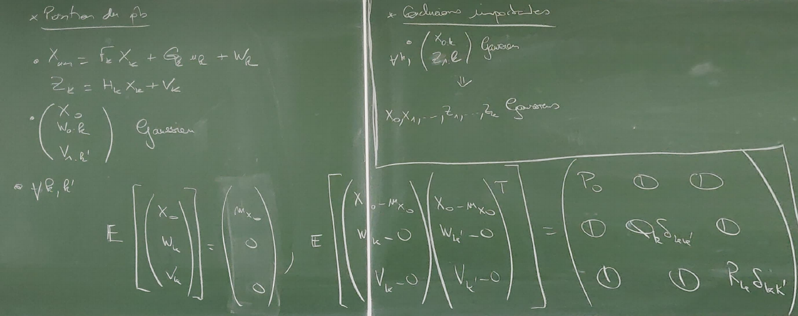
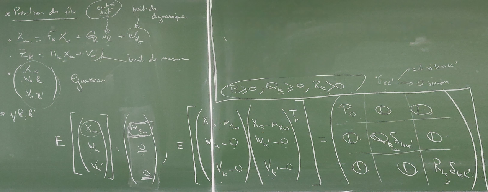
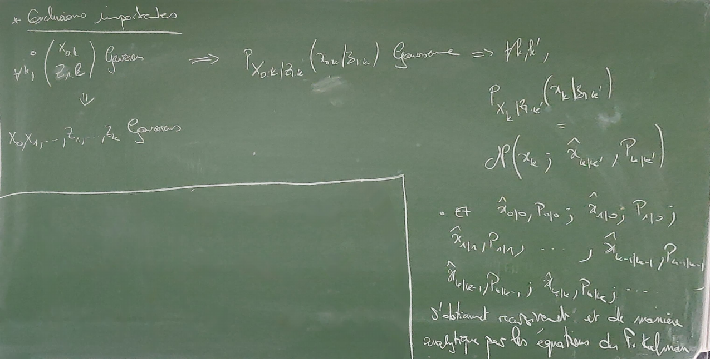
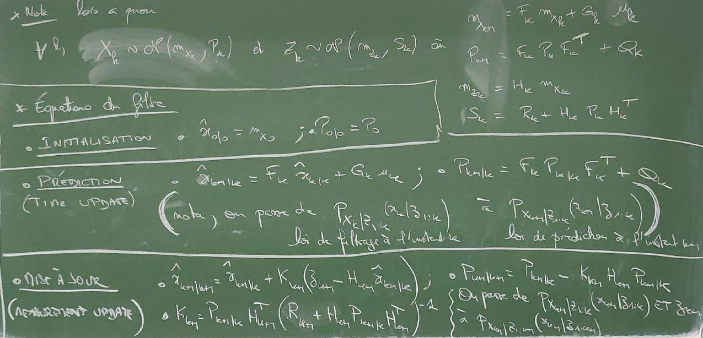
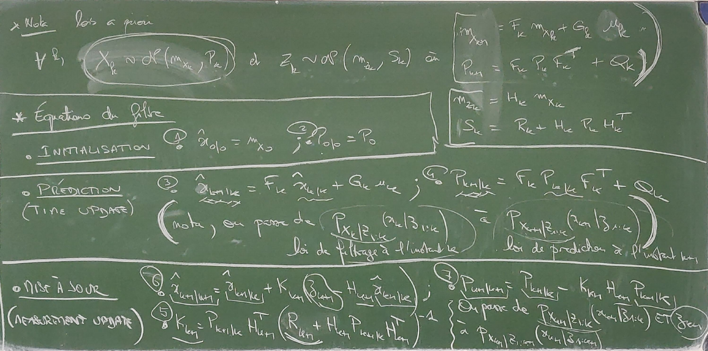
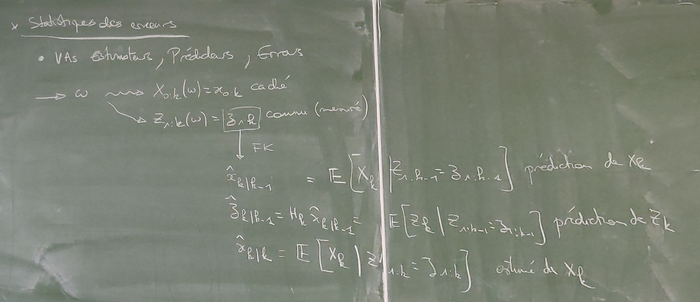
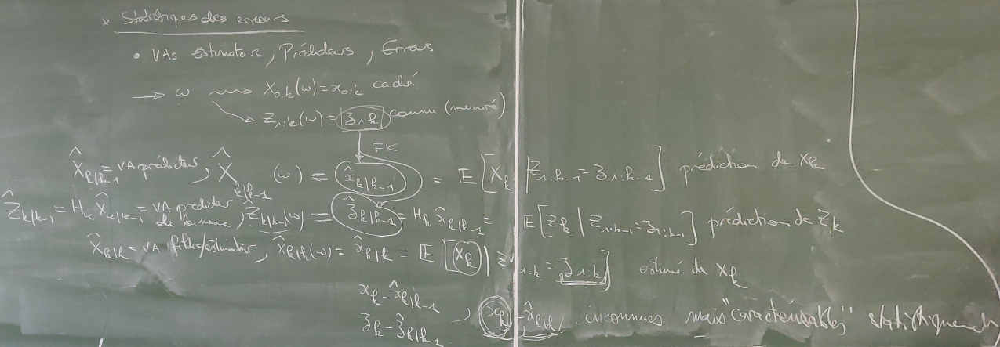
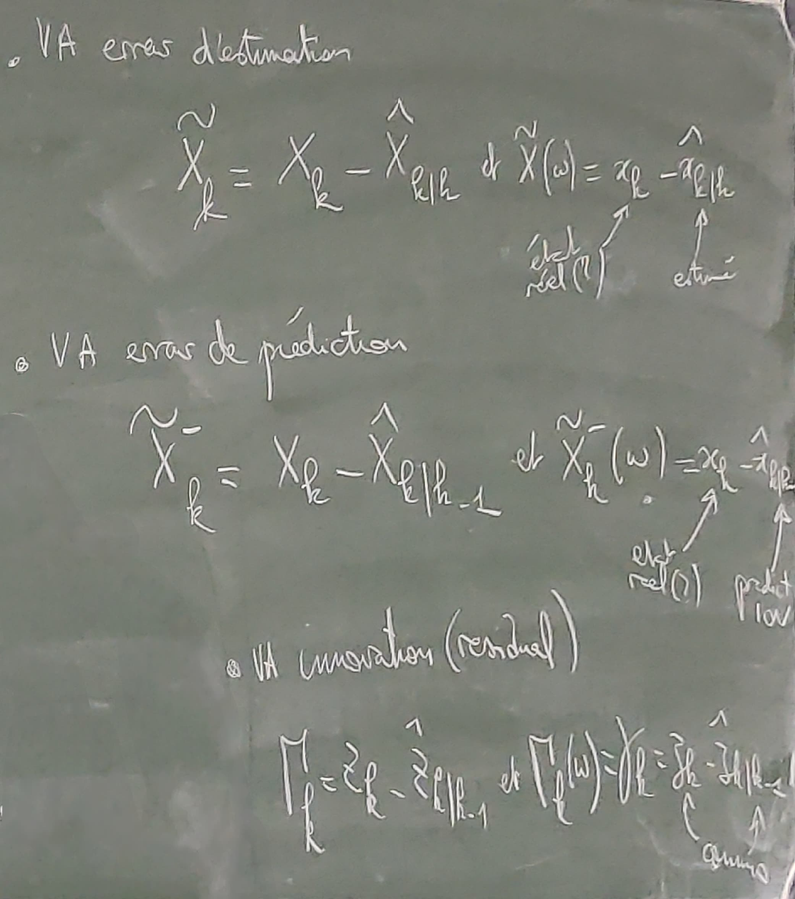

> **Avertissement:**
Cette page peut contenir des fautes ! Envoyez-moi un message sur [`#UT3-AURO-M2-2223-Request:matrix.org`](https://matrix.to/#/#UT3-AURO-M2-2223-Request:matrix.org) si vous en trouvez, merci.

> Cours donné par P. Danès

> Voir ce que **Grammien** veut dire

**Supports:**
- [Projet.P1K.Interlude.BB20221021.pdf](https://raw.githubusercontent.com/TunnARK/UT3-AURO-2223-S10-Dendron/main/vault/assets/Projet.P1K.Interlude.BB20221021.pdf)

---

## Position du Problème

- Processus d'état caché suit une équation d'état linéaire avec matrice F et G détermiste et un bruit de dynamique
- Equation de mesures possède une structure similaire avec H deterministe et V le bruit dynamique
- On assume que les conditions initiales sont gaussiennes donc les sous element du vecteur sont aussi gaussiens 
    - on veut que le système reste gaussien au cours de la recursivité
- X état caché et Z mesures de X manifestant son existence
- Pour le calcul de l'espérance, on assume que les valeurs moyennes des bruits (sinon on peut avoir des soucis d'observation)
- Esperance d'intercovariance
    - Attention $R_k$ est seulement **définie positive** du coup, dans certains cas, il faut faire attention à la dépendance statique lineaire entre les composant des bruits de mesure
    - Kronecker indique que les bruits sur deux temps différents sont indépendants mutuellement

## Conclusions Importantes

- tout ce qui va etre construit sera gaussien
- loi posterieure est gaussienne 
    - $k=k'$ filtrage trajectoriel
        <!--
        - sur toutes les experiences qui caracterise mon comportement
        -->
    - $k>k'$ prédiction trajectoriele renforcement ???
    - $k<k'$ lissage -> estimation

> cov à l'infi pour un syst stable tend vers une constante fini qui ressemblance à une fonction de lyapunov

> Moment = ???

## Equations du filtre

> Attention: faire la différence entre equations 7 et 5 peut amener à ne plus avoir une structure semi-définie positive mais seulement définie

## Problème du TUNING

On suppose avoir un modele a priori et essayer d'apprendre sur un tronçon de trajectoire donné

> Tester sur le [[TP de la Tortue|Projet.P1K.TPtortue]]

## Cas non linéaire

Le modèle avec Q et R est approximé dans le cas non linéaire ce que peut amener un loi posterieure trop optimiste (trop ressérrée).

## Statistiques de Erreurs

> On pourra pas connaitre $x_k-\^x_{k|k}$ car $\^x_{k|k}$ lui est basé sur une séquence de mesure que l'on ne peut pas distingué mutuellement

## Ellipsoides de l'erreur

Pour connaitre l'erreur d'estimation, il faut passer par des ellipsoides où l'on choisit la probabilité d'estimation sur l'$\alpha$ et le $\beta$

> Ceci n'est pas comparable à un observateur où l'erreur converge sagement sur 0