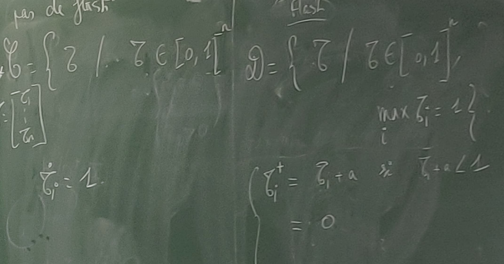
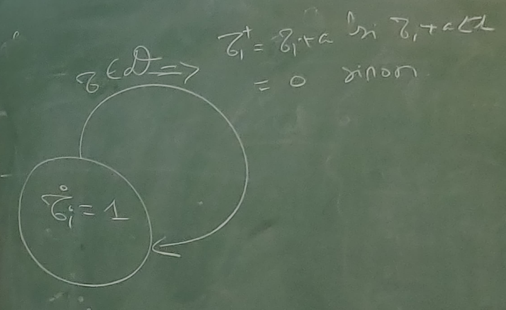
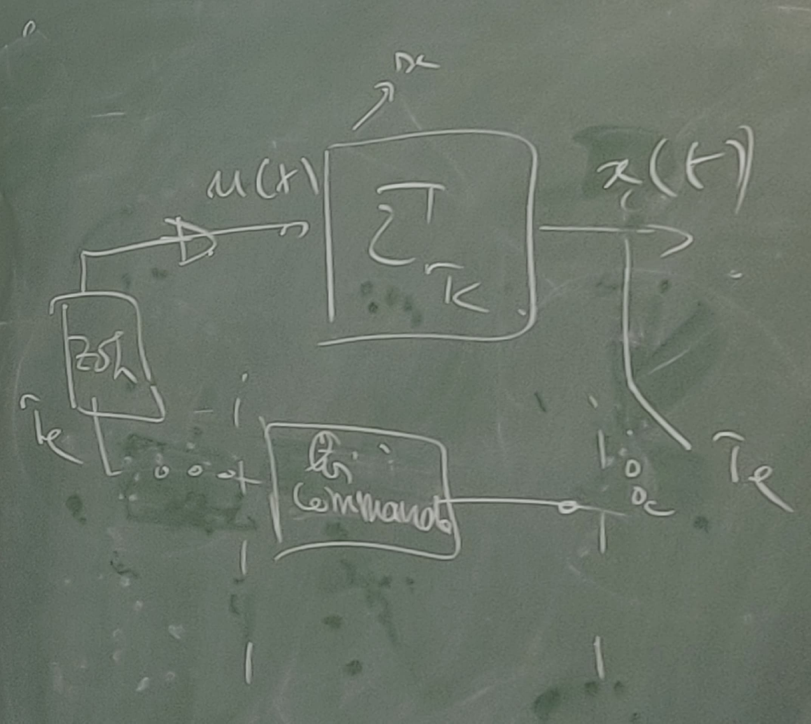
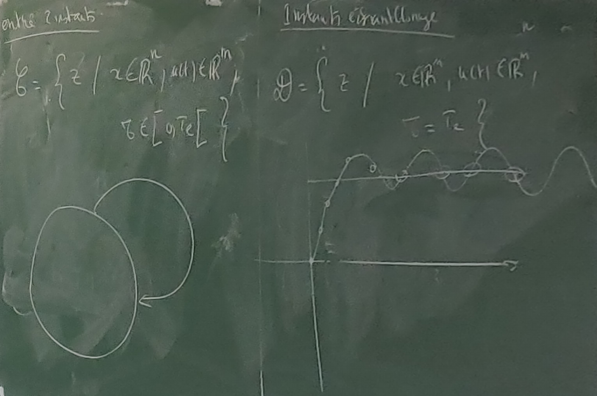

> **Avertissement:**
Cette page peut contenir des fautes ! Envoyez-moi un message sur [`#UT3-AURO-M2-2223-Request:matrix.org`](https://matrix.to/#/#UT3-AURO-M2-2223-Request:matrix.org) si vous en trouvez, merci.

> Cours donné par F. Gouaisbaut et P. Ribot

---

> Notes du 2023/01/05 - Start

# Sommaire

# 1) Introduction

## Objectifs

Système Hybride = Systeme mélangeant du formalisme STC et SED

Probleme de theories et de simulations.

## Modalités

# 2) Modélisation STC

## Modélisation formelle

STC = Systeme Temps Continu

entrees/sorties
etats
equation evolution
equation de sortie

## Hypothèses en TC

# 3) Modélisation de SED

## Caractéristiques des SED

SED = Syst. Evenement Discret

## Concept d'évènement

attention evenement est tj instantanee
exogene = exterieur
endogene = interieur

obsvble = mesurable
nonobsvble = blackpox carte dont on connait le fonctionne mais ne mesure pas

??? que ce passe-t-il lorsqu'on ne connait pas le fonctionnement ?

## Exemple syst. discret

### Entrepôt

### Réservoir d'eau

Problematique du choix du niveau d'abstraction

Maquette Bac Eaux tres dynamique mais peut aussi etre represente par un modele discret avec le bon niveau d'absatraction
Capteur binaire donc $2^4$ etats

une panne non observable mais si il y a un capteur pour declencher une alarme des qu'il y a une panne est-ce du coup obsvble ???

**Mealy** tout est evenement (tout sur les transitions) front montant sans ! front descendant avec !
Moore sorties sont des niveaux (donc ne se trouve pas sur les transitions) [similaire au reseau de petri]

si plusieurs valeurs possible alors on cree plusieurs etat discret pour faire l'abstraction de la dynamique

### Exemple syst discretisable: Air Conditionné

## Modélisation formelle d'un SED

## Modélisation par abstraction

# 4) Exemples

## SED

### Trains

### Bras manipulateur

## Automatique

### Rebond de balle

#### Principe fondamental

En lair mode 1

$\ddot x  = -g$ les etats $z = [x , \dot x]$ le systeme modelise est alors

$$
\dot z_1 = z_2\\
\dot z_2 = -g
$$

Au sol mode 2

$$
m\ddot x = -mg + F_{rsol} + F_{rebont}\\
\ddot x = - \lambda \dot x
$$

$$
\dot z_1 = 0\\
\dot z_2 = - \lambda \dot x
$$

#### Modélisation des modes

En lair
$$
\mathcal{C} = {z\in\mathbb{R}^2|z_1>0 or (z_1 = 0 and z_2>0)}
$$

Au sol
$$
\mathcal{D} = {z\in\mathbb{R}^2|z_1 = 0 and z_2\leq0}
$$

Phenomene de ré-initialisation
$$
z_1^{+} = 0\\
z_2^{+} = - \lambda z_2
$$

1er modele

**phenomene de zenon** quand la CI est z_1=z_2=0

mais vu que le mode sol est instantanee on peut le voir comme une action d'ou le 2eme modele

### Les lucioles

meme si un flash est un evenement ici on realise un modele globale qui lui considere l'horloge = 1 comme evenement (alors que localement la luciole considere le flash comme evenement)

si les lucioles se fatigue a chaque flash il faut adapter le modele

une option c'est de changer l'evolution $\dot \tau = a_i$ via une action conditionne sur $a_i$ (on change les parametres d'un meme modele au final)

autre option est de changer de modele qui lui cree un nouvel etat pour chaque changement d'evolution

cette derniere modelisation apporte l'advantage de garder trace de l'evolution des changements et donc pouvoir etudier le syst. d'un point de vue usage

### Le bloqueur d'ordre zéro

Pour l'automatique discrete, le bloqueur d'ordre zero fonctionne sur la theorie des SED

Ici ce modele est a temps continu du coup on s'affranchit l'approximation causer par une discretisation

# 5) Conclusion

> Keywords pour la recherche bibliographique: hybrid automata ; hybrid dynamical system

> termes à retenir

# 6) Bibliographie

> Notes du 2023/01/05 - End

---